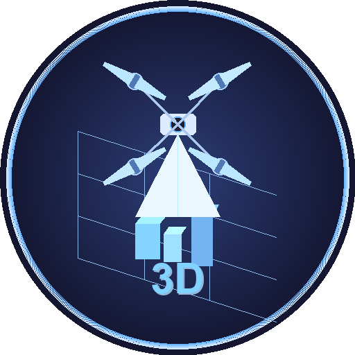

# OSGB → 3D Tiles 转换工具

> 将倾斜摄影 OSGB 数据转换为 Cesium 3D Tiles 格式的完整工具链，含多线程 CLI 转换引擎、原生 OSGB 三维浏览器和 Python GUI 前端。

**v0.0.1** · [English](README_EN.md) · [MIT License](LICENSE)

<p align="center">
  
</p>

---

## 目录

- [功能特性](#功能特性)
- [纹理格式性能对比](#纹理格式性能对比)
- [实现架构](#实现架构)
- [快速开始](#快速开始)
- [编译说明](#编译说明)
- [依赖库](#依赖库)
- [已知问题与解决方案](#已知问题与解决方案)
- [输出格式](#输出格式)
- [相关文档](#相关文档)
- [许可证](#许可证)

---

## 功能特性

### 🔧 CLI 转换引擎（`osgb2tiles.exe`）

| 能力 | 说明 |
|------|------|
| **多线程并行转换** | 默认使用所有 CPU 核，每个 Tile 块独立线程处理 |
| **自动坐标识别** | 支持 metadata.xml（ContextCapture/Smart3D）、production_meta.xml（大疆智图）、doc.xml（Metashape） |
| **通用投影支持** | 通过 GDAL/PROJ 自动将任意坐标系（CGCS2000、UTM、地方坐标系）转换为 WGS84 |
| **多纹理格式** | JPEG / PNG / WebP / **KTX2（Basis Universal ETC1S/UASTC）** |
| **网格简化** | 基于 meshoptimizer，可控简化比例 |
| **Draco 压缩** | 几何数据 Draco 无损压缩（减小 B3DM 体积约 70%） |
| **Bursa-Wolf 7参数** | 可选地方坐标系微调，精准对齐测量控制点 |
| **LOD 树生成** | 自动生成多 LOD 级别 tileset.json（geometricError 逐级递减） |
| **输出格式** | B3DM（Cesium 标准）或 GLB（独立文件） |

### 🏔 OSGB 三维浏览器（`osgb_viewer.exe`）

基于 OpenSceneGraph 的原生 OSGB 数据浏览器，无需转换即可直接查看倾斜摄影数据：

| 能力 | 说明 |
|------|------|
| **PagedLOD 流式加载** | 支持大规模倾斜摄影数据动态加载，自动 LOD 调度 |
| **天空盒背景** | 内置山脉天空盒贴图，沉浸式三维浏览体验 |
| **全屏模式** | 支持 F11 全屏切换 |
| **正射导出** | 一键导出正射影像（GeoTIFF 格式） |
| **全景导出** | 支持高分辨率全景图导出（12K+） |
| **Win32 原生窗口** | 无外部依赖，原生 Windows GUI |

### 🖥 GUI 前端（`osgb2tiles_gui.py` / `osgb2tiles_gui.exe`）

| 能力 | 说明 |
|------|------|
| **可视化参数配置** | 支持保存/加载 JSON 配置文件 |
| **实时日志显示** | 带进度条的转换日志（不阻塞主线程） |
| **OSGB 预览** | 两种模式：OSG 原生浏览器（推荐）或 Three.js WebGL 预览 |
| **3D Tiles 预览** | 内置 Cesium 本地预览，含渲染性能控制面板（SSE/内存/请求数/全局误差可调） |
| **深色主题** | Catppuccin Mocha 风格暗色界面 |
| **独立打包** | PyInstaller 打包为 exe，无需 Python 环境 |

---

## 纹理格式性能对比

> **测试环境**：8 核 CPU，原始 OSGB 数据约 **330 MB**（ContextCapture 倾斜摄影），默认线程数（= CPU 核数）

| 纹理格式 | 输出大小 | 耗时 | 压缩比¹ | GPU 直读 | 适用场景 |
|---------|---------|------|--------|---------|---------|
| **JPEG**（q=75） | ~350 MB | **~50 s** | 1.06× | ❌ | 快速预览、调试 |
| **WebP**（q=75） | **190 MB** | ~200 s | ~0.58× | ❌ | ⭐ **推荐默认**：体积最小且速度快 |
| **ETC1S**（KTX2） | **130 MB** | ~2000 s | ~0.39× | ✅ | 极致压缩、离线包分发 |
| **UASTC+zstd**（KTX2） | ~600 MB² | ~200 s | ~1.8× | ✅ | 高质量 GPU 纹理流式加载 |
| **PNG** | ~900 MB | ~60 s | ~2.7× | ❌ | 无损，仅调试用 |

¹ 压缩比 = 输出大小 / 原始 OSGB 大小（<1 表示比原始更小）
² UASTC 未加 zstd 时约 1.4 GB，加 zstd level-9 超压缩后约 600 MB

### 选择建议

```
追求 最快速度   →  JPEG  （50s，适合开发调试）
追求 最小体积   →  ETC1S （130MB，接受等待 33 分钟）
追求 速度+体积  →  WebP  （190MB / 200s，推荐）
追求 GPU 性能   →  UASTC+zstd（GPU 零解码开销，Cesium 流式加载效果最好）
```

---

## 实现架构

### 整体流程

```
OSGB 目录
   │
   ├─ 1. OsgbMetaReader   读元数据 XML → 获取坐标 → GDAL/PROJ 转 WGS84
   │
   ├─ 2. OsgbReader       扫描 Tile_xxx 块 → OSG 加载 .osgb/.osg 文件
   │                      提取几何（顶点/法线/UV）、纹理（内嵌/外部文件）
   │
   ├─ 3. GeometryConverter ENU 坐标 → ECEF 绝对坐标
   │                       可选 Bursa-Wolf 7参数变换
   │
   ├─ 4. TextureProcessor  缩放纹理（stb_image_resize）
   │                       编码为目标格式（JPEG/PNG/WebP/KTX2）
   │
   ├─ 5. MeshSimplifier   （可选）meshoptimizer 网格简化
   │
   ├─ 6. GlbWriter        组装 GLB/B3DM 二进制：
   │                       GLTF JSON + BIN + 纹理 → 单文件
   │
   └─ 7. TilesetBuilder   生成全局 tileset.json：
                            计算包围盒（Region/Box）、geometricError
```

### 坐标转换策略

1. 优先读取 `metadata.xml` 中的 SRS 字段，通过 **GDAL/PROJ** 将投影坐标转为 WGS84
2. GDAL 失败时回落到内置 **高斯-克吕格** 反算（Gauss-Kruger）
3. 命令行 `--lon/--lat/--alt` 的优先级最高，可跳过元数据读取

### KTX2 Basis Universal 编码

KTX2（ETC1S/UASTC）是 GPU 友好的压缩纹理格式，相比 JPEG 约减小 30–50% B3DM 体积：

```
RGB 像素数据
    → RGB → RGBA 扩展（alpha=255，BasisU 必须4通道）
    → ktxTexture2_Create（VK_FORMAT_R8G8B8A8_UNORM，generateMipmaps=FALSE）
    → ktxTexture_SetImageFromMemory
    → ktxTexture2_CompressBasisEx
    → ktxTexture_WriteToMemory
    → 写入 GLB texture buffer
```

---

## 快速开始

### 方式一：使用 GUI（推荐）

```bat
python osgb2tiles_gui.py
:: 或直接运行打包版：
osgb2tiles_gui.exe
```

### 方式二：命令行

```bat
:: 最简用法（自动读取 metadata.xml，默认 KTX2 纹理）
osgb2tiles.exe -i D:\data\OSGB -o D:\output\3DTiles

:: 手动指定坐标 + 4线程 + JPEG 纹理
osgb2tiles.exe -i D:\data\OSGB -o D:\output\3DTiles ^
  --lon 120.266674 --lat 36.260571 --alt 0 ^
  --threads 4 --tex-format jpg --jpeg-quality 80

:: KTX2 高质量（UASTC）+ Draco 几何压缩
osgb2tiles.exe -i D:\data\OSGB -o D:\output\3DTiles ^
  --tex-format ktx2 --ktx2-mode uastc --ktx2-quality 4 ^
  --draco --draco-bits 14

:: 使用配置文件（含七参数等完整配置）
osgb2tiles.exe -i D:\data\OSGB --config osgb2tiles_config.json
```

### 方式三：OSGB 浏览器

```bat
:: 直接打开 OSGB 目录浏览
osgb_viewer.exe D:\data\OSGB
```

### 参数速查

| 参数 | 默认值 | 说明 |
|------|--------|------|
| `-i/--input` | *必填* | OSGB 输入目录 |
| `-o/--output` | `./output` | 3D Tiles 输出目录 |
| `--lon/--lat/--alt` | 自动读取 | WGS84 原点坐标 |
| `--format` | `b3dm` | 输出格式：`b3dm` 或 `glb` |
| `--threads` | `4` | 并行线程数（0=自动） |
| `--tex-format` | `ktx2` | 纹理格式：`ktx2`/`jpg`/`png`/`webp` |
| `--ktx2-mode` | `etc1s` | KTX2 压缩模式：`etc1s`（小）或 `uastc`（高质量） |
| `--ktx2-quality` | `2` | KTX2 压缩质量 [1-5] |
| `--jpeg-quality` | `85` | JPEG 质量 [1-100] |
| `--webp-quality` | `80` | WebP 有损质量 [1-100] |
| `--simplify` | false | 启用网格简化 |
| `--simplify-ratio` | `0.5` | 简化比例 [0.1–1.0] |
| `--tex-size` | `2048` | 纹理最大尺寸（像素） |
| `--draco` | false | 启用 Draco 几何压缩 |
| `--draco-bits` | `14` | Draco 量化位数 [8-16] |
| `--geo-error` | `0.5` | geometricError 系数 [0.1-2.0] |
| `--config` | — | JSON 配置文件路径 |
| `-v/--verbose` | false | 详细日志 |

> 完整参数列表请查看 [CLI 参数说明](README_CLI参数说明.md) · 配置文件字段请查看 [配置文件说明](README_配置文件说明.md)

---

## 编译说明

### 环境要求

- **操作系统**：Windows 10/11 x64
- **编译器**：Visual Studio 2019 Build Tools（MSVC v142）
- **vcpkg**：已安装于 `C:\vcpkg`（manifest 模式）
- **CMake**：3.20+（通过 VS 安装）

### 编译步骤

#### 1. 首次配置（cmake configure）

```cmd
cmd /c "call "C:\Program Files (x86)\Microsoft Visual Studio\2019\BuildTools\VC\Auxiliary\Build\vcvars64.bat" && ^
  cmake -S . -B build ^
  -DCMAKE_TOOLCHAIN_FILE=C:/vcpkg/scripts/buildsystems/vcpkg.cmake ^
  -DVCPKG_TARGET_TRIPLET=x64-windows ^
  -DCMAKE_BUILD_TYPE=Release"
```

> 首次配置会自动通过 vcpkg 下载并安装所有依赖（耗时 30–60 分钟，视网络情况）。

#### 2. 增量编译（修改源码后）

```cmd
cmd /c "call "C:\Program Files (x86)\Microsoft Visual Studio\2019\BuildTools\VC\Auxiliary\Build\vcvars64.bat" && cd build && nmake /S"
```

#### 3. 编译输出

```
build/bin/osgb2tiles.exe        ← 主转换程序
build/bin/osgb_viewer.exe       ← OSGB 三维浏览器
build/bin/*.dll                 ← 所有依赖 DLL（90 个，完全自包含）
build/bin/osgPlugins-3.6.5/    ← OSG 读取插件（91 个）
build/bin/proj/proj.db          ← PROJ 坐标数据库
build/bin/gdal-data/            ← GDAL 投影数据
```

### GUI 打包（可选）

```bat
pip install pyinstaller
pyinstaller osgb2tiles_gui.spec
:: 输出：dist/osgb2tiles_gui.exe
```

---

## 依赖库

| 库 | 版本 | 用途 | 来源 |
|----|------|------|------|
| **OpenSceneGraph** | 3.6.5 | 读取 OSGB/OSG 格式 | vcpkg `osg` |
| **GDAL** | 3.9.x | 坐标系转换（任意→WGS84） | vcpkg `gdal` |
| **PROJ** | 9.4.x | GDAL 依赖的投影数据库 | vcpkg 随 gdal |
| **nlohmann/json** | 3.11.x | JSON 配置解析 | vcpkg `nlohmann-json` |
| **cxxopts** | 3.1.x | CLI 参数解析 | vcpkg `cxxopts` |
| **stb** | latest | 图像加载/缩放/JPEG编码 | vcpkg `stb` |
| **libwebp** | 1.4.x | WebP 纹理编码 | vcpkg `libwebp` |
| **meshoptimizer** | 0.21.x | 网格简化与优化 | vcpkg `meshoptimizer` |
| **draco** | 1.5.x | 几何数据 Draco 压缩（可选） | vcpkg `draco` |
| **libktx** | **4.4.2** | KTX2/Basis Universal 编码 | vcpkg `ktx`（overlay） |
| **tinygltf** | 2.9.x | GLTF JSON 辅助 | vcpkg `tinygltf` |
| Python | 3.8+ | GUI 前端运行环境 | 系统 |
| PyInstaller | 6.x | GUI 打包为独立 exe | pip |

---

## 已知问题与解决方案

<details>
<summary><b>KTX2 压缩全部失败（CompressBasis failed: 10）</b></summary>

**根因**：libktx v4.4.2 中 `generateMipmaps=KTX_TRUE` 与 `ktxTexture2_CompressBasisEx` 存在兼容性 bug。

**解决**：始终设 `ci.generateMipmaps = KTX_FALSE`，mipmap 由 GPU 渲染器实时生成。

其他注意点：
- BasisU 必须传 RGBA（4通道）数据
- vkFormat 用 `VK_FORMAT_R8G8B8A8_UNORM`，不可用 SRGB 变体
- `inputSwizzle` 需显式设为 `'r','g','b','a'`
</details>

<details>
<summary><b>OSGB 文件加载失败（Windows 8.3 短路径问题）</b></summary>

**根因**：中文/空格目录下路径转换为 8.3 短路径后 OSG 找不到文件。

**解决**：启动时调用 `GetLongPathNameW` 还原完整 UTF-16 路径。
</details>

<details>
<summary><b>PROJ 找不到数据库（坐标转换失败）</b></summary>

**解决**：程序启动时自动搜索 exe 同目录的 `proj/proj.db` 并设置 `PROJ_DATA` 环境变量。
</details>

<details>
<summary><b>vcpkg ktx 库编译需要 overlay</b></summary>

标准 vcpkg `ktx` port 不含 Basis Universal 编码器。需使用项目自带的 `vcpkg-overlay/ktx/` 目录。
</details>

---

## 输出格式

```
<输出目录>/
  tileset.json                ← 根入口（Cesium 加载此文件）
  Data/
    Tile_+007_+009/
      tileset.json            ← 块级 LOD 树
      Tile_+007_+009.b3dm     ← 最低 LOD（根节点）
      Tile_+007_+009_L15_0u.b3dm
      ...（L15~L22 多级 LOD）
    Tile_+007_+010/
      ...
```

### Cesium 加载

```javascript
const tileset = await Cesium.Cesium3DTileset.fromUrl(
    'http://localhost:8080/tileset.json'
);
viewer.scene.primitives.add(tileset);
```

快速启动本地 HTTP 服务：
```bat
npx http-server D:\output\3DTiles --cors -p 8080
```

---

## 相关文档

| 文档 | 内容 |
|------|------|
| [README_CLI参数说明.md](README_CLI参数说明.md) | 命令行参数完整列表 |
| [README_配置文件说明.md](README_配置文件说明.md) | JSON 配置文件字段说明 |
| [DEV_ENV.md](DEV_ENV.md) | 开发环境路径与编译命令速查 |
| [README_EN.md](README_EN.md) | English version |

---

## 许可证

本项目采用 [MIT License](LICENSE) 开源。
